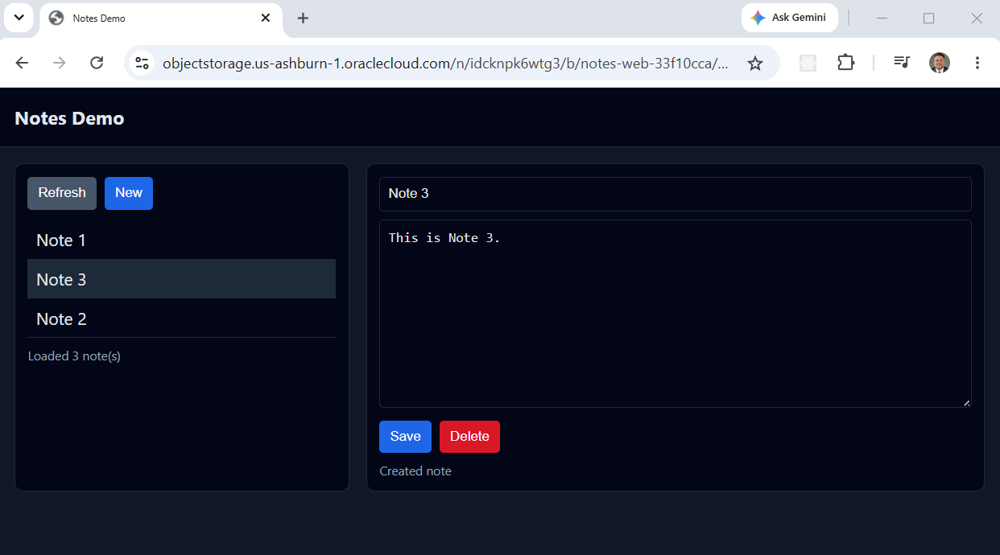
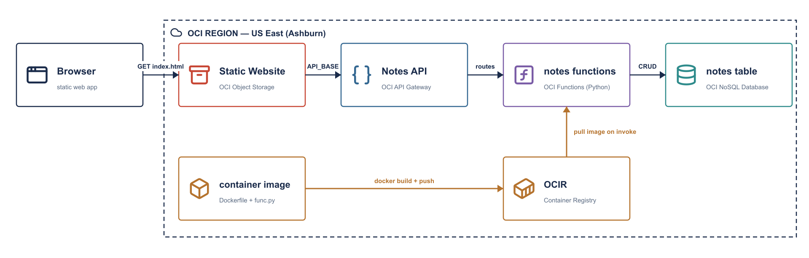

# OCI Serverless CRUD API

This project delivers a fully automated **serverless CRUD (Create, Read, Update,
Delete) API** on OCI, built using **OCI API Gateway**, **OCI Functions**, and
**OCI NoSQL Database**.

It uses **Terraform** and **Python (oci SDK + fdk)** to provision and deploy a
**stateless, REST-style backend** that exposes HTTP endpoints for managing simple
“notes” data — all without running or managing any compute instances.

This is the OCI port of **aws-crud-example**.

For testing and demonstration purposes, a lightweight **HTML web frontend**
interacts directly with the deployed API, allowing users to create, view, update,
and delete notes from a browser.



This design follows a **serverless microservice architecture** where API Gateway
routes requests to dedicated OCI Functions, OCI NoSQL Database provides fully
managed persistence, and OCI handles scaling, availability, and fault tolerance
automatically.



Key capabilities demonstrated:

1. **Serverless CRUD API** – Implements REST-style endpoints backed by OCI
   Functions for creating, retrieving, listing, updating, and deleting records.
2. **Stateless Compute Layer** – Each Function is independent and stateless,
   enabling horizontal scaling and zero idle cost.
3. **Managed NoSQL Storage** – Uses OCI NoSQL Database with on-demand capacity
   for low-latency, fully managed data persistence.
4. **Container-Based Functions** – OCI Functions run *containers*, not raw code:
   one Docker image is built, pushed to **OCIR** (OCI's container registry), and
   pulled by all five Functions at invoke time.
5. **Infrastructure as Code (IaC)** – Terraform provisions API Gateway routes,
   Functions, IAM policies, the NoSQL table, and supporting resources in a
   repeatable, auditable way.
6. **Browser-Based Test Client** – A simple static HTML frontend demonstrates
   real-time interaction with the API without requiring additional tooling.

Together, these components form a **clean, minimal reference architecture** for
building serverless APIs on OCI — suitable for learning, prototyping, or
extending into more advanced event-driven and authenticated microservices.

## API Gateway Endpoints

The **Notes API** exposes REST-style CRUD endpoints through **OCI API Gateway**.
These endpoints allow clients to create, list, retrieve, update, and delete
notes stored in OCI NoSQL Database. All endpoints return JSON and work with both
CLI and browser-based clients.

> Note: In this simplified demo, the note `owner` is hardcoded to `"global"` in
> the Function handlers.

### API Endpoint Summary

| Method | Path | Purpose | Input | NoSQL Operation |
|------|------|--------|------|--------------------|
| POST | `/notes` | Create a new note | JSON body (`title`, `note`) | `update_row` (IF_ABSENT) |
| GET | `/notes` | List all notes | None | `query` (owner = "global") |
| GET | `/notes/{id}` | Retrieve a single note by ID | Path param (`id`) | `get_row` |
| PUT | `/notes/{id}` | Update an existing note | Path param + JSON body | `update_row` (IF_PRESENT) |
| DELETE | `/notes/{id}` | Delete a note by ID | Path param (`id`) | `delete_row` |

> **OCI path-parameter quirk:** API Gateway does not pass `{id}` to the Function
> body. A header-transformation policy injects `${request.path[id]}` as the
> `X-Note-Id` request header, which the handler reads via
> `ctx.Headers().get("x-note-id")`.

### Request & Response Characteristics

| Aspect | Behavior |
|-----|--------|
| Authentication | None (demo-only) |
| Content Type | `application/json` |
| Owner Model | Hardcoded to `"global"` |
| Response Format | JSON |
| Clients | curl, browser, any HTTP client |
| Error Handling | Standard HTTP status codes |

---

### POST /notes

**Purpose:**
Creates a new note in OCI NoSQL Database.

**Request Body (JSON):**
```json
{
  "title": "Test Note 1",
  "note": "This is test note 1"
}
```

**Parameters:**

| Field | Type | Required | Description |
|------|------|----------|-------------|
| title | string | Yes | Note title |
| note | string | Yes | Note body/content |

**Example Request:**
```bash
curl -s -X POST https://<gateway-id>.apigateway.us-ashburn-1.oci.customer-oci.com/notes \
  -H "Content-Type: application/json" \
  -d '{"title":"Test Note 1","note":"This is test note 1"}'
```

**Example Response (201):**
```json
{
  "id": "2f2d0c5a-9f5f-4d7d-9e2c-1c8a5b8e3c21",
  "title": "Test Note 1",
  "note": "This is test note 1"
}
```

---

### GET /notes

**Purpose:**
Lists all notes for the demo owner (`"global"`).

**Example Request:**
```bash
curl -s https://<gateway-id>.apigateway.us-ashburn-1.oci.customer-oci.com/notes
```

**Example Response (200):**
```json
{
  "items": [
    {
      "owner": "global",
      "id": "2f2d0c5a-9f5f-4d7d-9e2c-1c8a5b8e3c21",
      "title": "Test Note 1",
      "note": "This is test note 1",
      "created_at": "2026-01-19T14:12:09.123456+00:00",
      "updated_at": "2026-01-19T14:12:09.123456+00:00"
    }
  ]
}
```

---

### GET /notes/{id}

**Purpose:**
Retrieves a single note by ID.

**Example Request:**
```bash
curl -s https://<gateway-id>.apigateway.us-ashburn-1.oci.customer-oci.com/notes/<id>
```

---

### PUT /notes/{id}

**Purpose:**
Updates an existing note.

**Request Body (JSON):**
```json
{
  "title": "Test Note 1",
  "note": "Updated note"
}
```

---

### DELETE /notes/{id}

**Purpose:**
Deletes a note by ID.

**Example Request:**
```bash
curl -s -X DELETE https://<gateway-id>.apigateway.us-ashburn-1.oci.customer-oci.com/notes/<id>
```

## Prerequisites

* [An OCI (Oracle Cloud) Account](https://www.oracle.com/cloud/free/)
* [Install and configure the OCI CLI](https://docs.oracle.com/en-us/iaas/Content/API/SDKDocs/cliconfigure.htm)
* [Install Terraform](https://developer.hashicorp.com/terraform/install)
* [Install Docker](https://docs.docker.com/get-docker/) — required to build and push the Functions image to OCIR
* `jq` and `envsubst` — used by the automation scripts

## Download this Repository

```bash
git clone https://github.com/mamonaco1973/oci-crud-example.git
cd oci-crud-example
```

## Build the Code

Run [check_env](check_env.sh) to validate your environment, then run [apply](apply.sh) to provision the infrastructure.

```bash
~/oci-crud-example$ ./apply.sh
NOTE: Running environment validation...
NOTE: Validating that required commands are found in your PATH.
NOTE: oci is found in the current PATH.
NOTE: terraform is found in the current PATH.
NOTE: docker is found in the current PATH.
NOTE: jq is found in the current PATH.
NOTE: envsubst is found in the current PATH.
NOTE: All required commands are available.
NOTE: Checking OCI CLI connection.
NOTE: Successfully connected to OCI.

Initializing the backend...
```

`apply.sh` runs in phases: it provisions the OCIR repository, **builds and pushes
the Docker image** (`02-docker/build.sh`), then applies the Functions + API
Gateway + NoSQL layer, and finally uploads the web frontend to Object Storage.

### Build Results

When the deployment completes, the following resources are created:

- **Core Infrastructure:**
  - Serverless compute—no VM instances to manage
  - A minimal VCN (subnet + gateway) so Functions have egress to OCIR and NoSQL
  - Terraform-managed provisioning of API Gateway, Functions, NoSQL, OCIR, and
    Object Storage resources
  - Stateless, request-driven design where each API call is handled independently

- **Security & IAM:**
  - A Dynamic Group + IAM policies grant the Functions row access to NoSQL and
    let API Gateway invoke the Functions
  - Functions authenticate with a **Resource Principal**—no keys or secrets in
    application code
  - Principle-of-least-privilege policies scoped to the compartment

- **OCI NoSQL Database:**
  - Single table storing notes keyed by `owner` (shard key) and `id` (sort key)
  - Each row stores `title`, `note`, `created_at`, and `updated_at` attributes
  - On-demand capacity for automatic scaling and cost efficiency

- **OCI Functions (container-based):**
  - Five Python Functions implementing Create, Read, Update, List, and Delete
  - **One Docker image** in OCIR serves all five; the `FUNCTION_TYPE` environment
    variable dispatches each Function to the right handler
  - Each Function is mapped to a specific API route and emits logs to OCI Logging

- **OCIR (Container Registry):**
  - Holds the notes-functions image; a content-hash tag forces a Function update
    whenever the code changes
  - The Functions pull the image on invoke—the OCI-specific "no code upload" step

- **OCI API Gateway:**
  - Exposes REST-style `/notes` and `/notes/{id}` endpoints
  - Routes requests to the appropriate Function based on HTTP method and path
  - Injects `{id}` as the `X-Note-Id` header for path-parameter routes

- **Static Web Application (Object Storage):**
  - Public bucket configured for static website hosting
  - `index.html` provides a lightweight browser-based interface for managing notes
  - Frontend dynamically calls the deployed API Gateway endpoints

- **Automation & Validation:**
  - `apply.sh`, `destroy.sh`, and `check_env.sh` scripts automate provisioning,
    teardown, and environment validation
  - `validate.sh` performs end-to-end API verification using curl and jq
  - Entire workflow runs using Terraform and the OCI CLI—no manual OCI console
    setup required

Together, these resources form a **clean, minimal serverless CRUD application**
that demonstrates modern OCI API design principles—simple, scalable, and fully
managed from infrastructure to application code.
